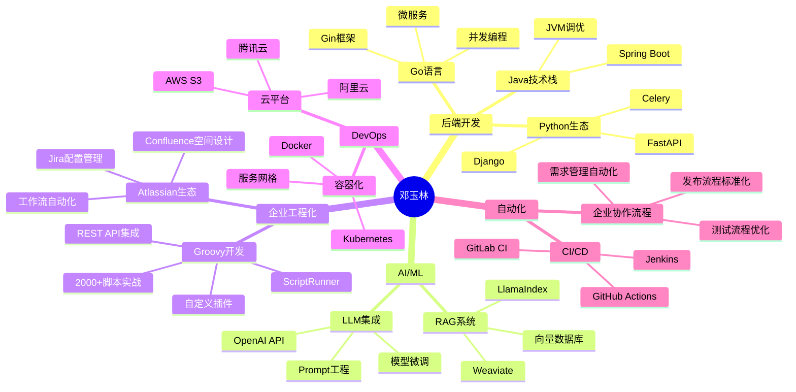

# 👋 Hi there, 我是邓玉林

<h3 align="center">
🚀 AI平台后端工程师 | 🧠 RAG商业项目实战操手 | ⚡ Jira/Confluence工程化专家 
🔥 Python/Go/Java多能式引擎师 | 🛠️ Groovy插件开发达人 | 💡 7年全栈架构经验
</h3>

  
  
  

---
## 🧠 关于我

<!-- 自动高度、无边框、最大宽度限制 -->
<table style="border:none; width: 100%; max-width: 900px;">
  <tr>
    <!-- 左侧：文字 -->
    <td width="50%" valign="top" style="padding-right: 20px;">

<pre>
<code>
name: 邓玉林
role: AI平台后端工程师
experience: 7年全栈开发经验
location: 中国
focus: ["AI/RAG系统", "Jira/Confluence工程化", "Groovy插件开发", "高性能架构"]
motto: "不只是写代码，更是设计系统思维与智能工具"
</code>
</pre>

<ul>
  <li>🧩 <strong>7年+</strong> 后端开发经验，擅长构建稳定、高性能、自动化的系统架构</li>
  <li>🤖 熟悉企业权限体系、AD 集成与工单自动化，流程全打通</li>
  <li>🧬 热衷 <strong>LLM/RAG</strong> 系统研发，主导 Weaviate + LlamaIndex 项目落地</li>
  <li>📊 <strong>Jira/Confluence</strong> 工程化配置专家，写过 <strong>2000+</strong> Groovy 脚本给 Jira 套上"程序员外挂"</li>
  <li>🔧 精通 <strong>Groovy 插件开发</strong>，自研多款 Atlassian 生态插件，深度定制企业协作流程</li>
  <li>💡 精通 <strong>Python/Go/Java</strong> 三栈共融，能写业务也能写平台</li>
</ul>

</td>

<!-- 右侧：两图上下自然排列 -->
<td width="50%" valign="top" align="center">
  
    
  
</td>
</tr>
</table>

## 💻 技术标签

### 🚀 后端开发

### 🤖 AI & 数据

### 🗄️ 数据库 & 缓存

### ☁️ 云原生 & DevOps

### 🛠️ 企业工程化 & 插件开发

## 🧪 项目代表作

<b>🔍 RAG 智能问答平台</b> - 企业级知识库智能检索系统

- **技术栈**: LlamaIndex + Weaviate + FastAPI + Redis
- **核心特性**: 结构化语义问答 + 多维度字段过滤
- **性能指标**: 支持百万级文档检索，毫秒级响应
- **业务价值**: 提升企业知识管理效率300%

<b>🧩 统一账号权限平台 Eagle</b> - 企业级身份管理系统

- **技术栈**: Django + MySQL + Redis + LDAP
- **核心功能**: 跨系统账号生命周期管理，AD/Moka/工单全打通
- **系统规模**: 管理10000+员工账号，接入50+业务系统
- **自动化率**: 账号开通/变更/注销流程自动化达95%

<b>🔧 Jira/Confluence 企业工程化平台</b> - 全流程研发协作自动化系统

- **技术实现**: 2000+ Groovy 脚本 + ScriptRunner + REST API + Webhook
- **平台配置**: Jira 工作流设计、Confluence 知识库架构、权限体系规划
- **插件开发**: 自研多款 Atlassian 插件，支持自定义字段、报表、审批流程
- **覆盖场景**: 需求分析、开发排期、测试管理、版本发布、知识沉淀
- **效率提升**: 减少80%手工操作，提升团队协作效率
- **创新点**: 自研脚本引擎，支持热部署、版本回滚和A/B测试

<b>📁 WebDAV 对象存储访问系统</b> - 云存储网络盘解决方案

- **技术架构**: FastAPI + Redis + AWS S3 + IAM
- **核心价值**: 将 S3 桶封装为可挂载网络盘
- **安全特性**: 自定义认证、细粒度访问控制、权限管理
- **兼容性**: 支持Windows/Mac/Linux多平台挂载

<b>🚪 智能酒店 PMS 系统</b> - 全链路酒店管理平台

- **技术基础**: Django + PostgreSQL + Redis + WebSocket
- **业务覆盖**: 前台、客房、工程、财务全流程数字化
- **实时特性**: 房态实时同步、入住离店流程自动化
- **多角色**: 支持管理员、前台、保洁、工程等角色权限管理

## 📊 GitHub 数据看板

<!-- GitHub Activity Graph (备用: 如果无法显示，可以注释掉) -->

## 🎯 技能图谱

## 🏆 成就徽章

> 💡 **"不只是写代码，更是设计系统思维与智能工具。"**  
> *—— 邓玉林*

---

**⭐ 如果觉得有帮助，请给个 Star ⭐**

