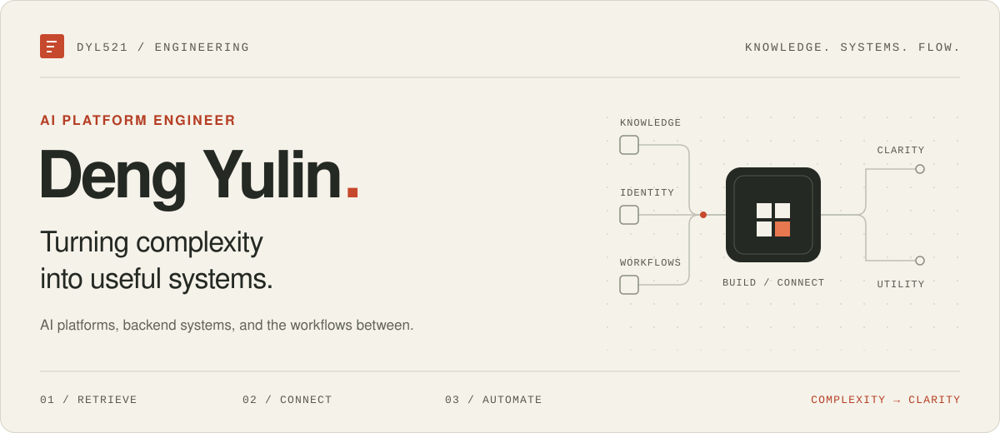

  

  <strong>AI platforms · Backend engineering · Enterprise automation</strong> 
  I build knowledge systems, connect internal tools, and turn complex workflows into useful software.

  <a href="mailto:1016068291@qq.com">Email me</a> &nbsp; / &nbsp;
  <a href="https://github.com/DYL521?tab=repositories">Explore repositories</a> &nbsp; / &nbsp;
  <a href="#中文介绍">中文介绍</a>

 

## Selected work

Three areas where I bring AI, backend systems, and business operations together.

### 01 / Knowledge systems

**RAG Intelligent Q&A Platform** 
Making enterprise knowledge easier to retrieve and use. A question-answering platform with metadata filtering and structured answers, connecting retrieval with the context people need.

`LlamaIndex` `Weaviate` `FastAPI` `Redis`

---

### 02 / Identity infrastructure

**Identity & Permission Platform** 
Connecting account lifecycle workflows across internal systems. Identity automation built around LDAP and Active Directory integration, bringing account and permission management into a shared platform.

`Django` `MySQL` `Redis` `LDAP`

---

### 03 / Workflow engineering

**Jira / Confluence Engineering Platform** 
Turning collaboration tools into programmable infrastructure. Custom plugins, scripts, and API integrations that make internal workflows easier to orchestrate and extend.

`Groovy` `ScriptRunner` `REST APIs` `Custom plugins`

 

## Engineering approach

- **Start with the workflow.** Understand where people lose time before deciding what to build.
- **Make complexity manageable.** Turn scattered tools and processes into systems with clear boundaries.
- **Build for lasting usefulness.** Care about whether a tool still saves time months after release.

### Tools I work with

**Languages** &nbsp; Python · Go · Java · Groovy 
**AI & backend** &nbsp; LlamaIndex · Weaviate · FastAPI · Django 
**Data & infrastructure** &nbsp; PostgreSQL · MySQL · Redis · Docker · Kubernetes · AWS 
**Enterprise integrations** &nbsp; LDAP / AD · Jira · Confluence · REST APIs

 

## 中文介绍

<strong>邓玉林 / AI 平台工程师 — 把复杂问题，做成可用的系统。</strong>

 

我关注 AI、后端工程与业务流程的交叉点，喜欢把分散的知识、内部工具和复杂流程，整理成清晰、实用的系统。

**01 / 企业知识系统** 
基于 LlamaIndex、Weaviate、FastAPI 和 Redis 构建 RAG 智能问答平台，支持企业知识检索、元数据过滤与结构化回答。

**02 / 身份与权限平台** 
基于 Django、MySQL、Redis 和 LDAP，实现账号生命周期自动化，连接 AD 与内部系统的账号和权限管理流程。

**03 / 协作流程工程化** 
通过 Groovy、ScriptRunner、REST API 与自研插件扩展 Jira / Confluence，让协作流程具备可编排、可扩展的工程能力。

我重视真实工作流、清晰的系统边界，以及上线之后仍能持续节省时间的工具。

欢迎交流 **AI 平台、RAG、后端系统与企业自动化**：<a href="mailto:1016068291@qq.com">1016068291@qq.com</a>。

 

---

**Have a complex workflow worth simplifying?** 
Let's talk about AI platforms, backend systems, or enterprise automation.

[1016068291@qq.com](mailto:1016068291@qq.com) &nbsp; ↗
