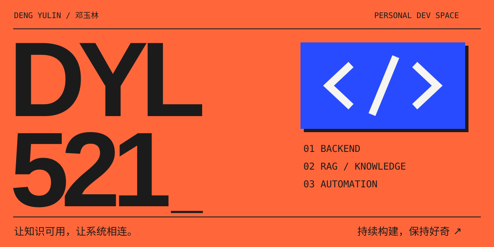

### Hey, I’m Yulin. 这里是我的开发现场。

做 AI 平台与后端，关心知识怎么被用起来，也关心每天能少做多少重复操作。

从 RAG 检索、MCP 工具接入，到账号权限和协作流程——我做的事，往往发生在系统与系统之间。

[个人网站 ↗](https://dyl521.github.io/) · [代码仓库 ↗](https://github.com/DYL521?tab=repositories) · [写信给我 ↗](mailto:1016068291@qq.com)

## 做过的，比标签更具体。

  
  

**[Jarvis Registry](https://github.com/ascending-llc/jarvis-registry)** — 参与企业 AI 基础设施开发，包括 [embedding reindexing](https://github.com/ascending-llc/jarvis-registry/commit/cfa8267b5f57471544bce4a7e8b3ffe9ed05fb44) 和 [tool access controls](https://github.com/ascending-llc/jarvis-registry/commit/5ebe945115059765ab8d3da1b4422a62dbd15470).

**[Agentic Design Patterns CN](https://github.com/DYL521/Agentic-Design-Patterns-CN)** — 整理 AI Agent 设计模式的中英文资料，连接概念与实现示例。

## 我的代码，通常出现在这些地方。

| 方向 | 想解决的问题 |
| :--- | :--- |
| **知识检索 / RAG** | 让散落的企业知识能被检索，形成结构清晰的回答。 |
| **身份与权限** | 连接 AD 与内部系统，减少账号管理中的重复操作。 |
| **协作自动化** | 让 Jira / Confluence 流程可以用脚本和 API 编排。 |

<strong>Inside the systems / 项目细节</strong>

### RAG Intelligent Q&A Platform

Enterprise knowledge retrieval with **metadata filtering** and **structured answers**, built with LlamaIndex, Weaviate, FastAPI, and Redis.

企业知识检索与智能问答：通过元数据过滤和结构化回答，让知识更容易被找到和使用。

### Identity & Permission Platform

**Account lifecycle automation** across internal systems, connecting LDAP / Active Directory workflows with Django, MySQL, and Redis.

统一账号与权限管理：连接 AD 和内部系统，减少账号生命周期中的重复操作。

### Jira / Confluence Engineering Platform

**Scripts, custom plugins, and REST API integrations** that turn collaboration workflows into programmable infrastructure.

协作流程工程化：使用 Groovy、ScriptRunner、REST API 与自研插件，让流程可编排、可扩展。

<strong>工具箱 / Python、Go、后端与基础设施</strong>

| Area | Tools |
| :--- | :--- |
| Languages | `Python` `Go` `Java` `Groovy` |
| AI & backend | `LlamaIndex` `Weaviate` `FastAPI` `Django` |
| Data | `PostgreSQL` `MySQL` `Redis` |
| Infrastructure | `Docker` `Kubernetes` `AWS` `Git` |
| Integrations | `MCP` `LDAP / AD` `Jira` `Confluence` `REST APIs` |

## 站外还有一个我。

如果你也在做 RAG、后端系统或企业自动化，欢迎交流具体的问题和实现。

**[去我的个人网站看看 ↗](https://dyl521.github.io/)**

[1016068291@qq.com](mailto:1016068291@qq.com) · [GitHub / DYL521](https://github.com/DYL521)

---

DYL521 · BUILD / CONNECT / REPEAT
