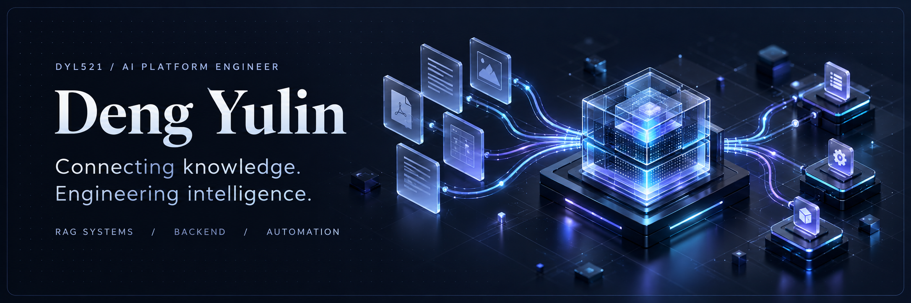
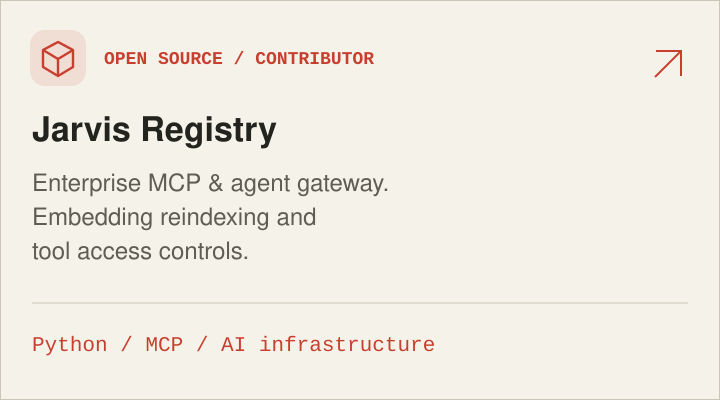
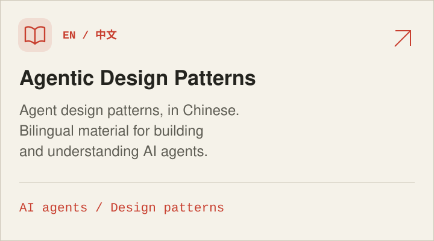
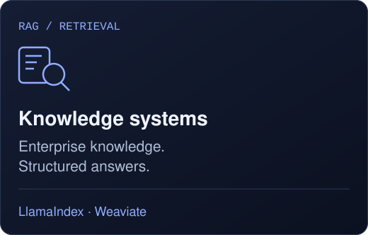
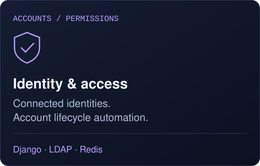
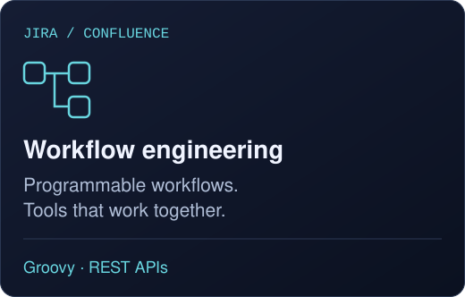

  

  <strong>Hi, I'm Yulin / 邓玉林 👋</strong> 
  I build AI platforms, connect enterprise systems, and make complex workflows easier to use. 
  专注 RAG、后端架构与企业自动化，把技术做成真正有用的系统。

  
  
  

## Open source · 开源实践

  
  

**[Jarvis Registry](https://github.com/ascending-llc/jarvis-registry)** — Contributing to enterprise AI infrastructure, including [embedding reindexing](https://github.com/ascending-llc/jarvis-registry/commit/cfa8267b5f57471544bce4a7e8b3ffe9ed05fb44) and [tool access controls](https://github.com/ascending-llc/jarvis-registry/commit/5ebe945115059765ab8d3da1b4422a62dbd15470).

**[Agentic Design Patterns CN](https://github.com/DYL521/Agentic-Design-Patterns-CN)** — A Chinese/English resource on AI agent design patterns, connecting concepts with implementation examples.

## Engineering focus · 工程方向

  
  
  

<strong>Inside the systems / 项目细节</strong>

### RAG Intelligent Q&A Platform

Enterprise knowledge retrieval with **metadata filtering** and **structured answers**, built with LlamaIndex, Weaviate, FastAPI, and Redis.

企业知识检索与智能问答：通过元数据过滤和结构化回答，让知识更容易被找到和使用。

### Identity & Permission Platform

**Account lifecycle automation** across internal systems, connecting LDAP / Active Directory workflows with Django, MySQL, and Redis.

统一账号与权限管理：连接 AD 和内部系统，减少账号生命周期中的重复操作。

### Jira / Confluence Engineering Platform

**Scripts, custom plugins, and REST API integrations** that turn collaboration workflows into programmable infrastructure.

协作流程工程化：使用 Groovy、ScriptRunner、REST API 与自研插件，让流程可编排、可扩展。

## Toolbox · 技术栈

| Area | Tools |
| :--- | :--- |
| Languages | `Python` `Go` `Java` `Groovy` |
| AI & backend | `LlamaIndex` `Weaviate` `FastAPI` `Django` |
| Data | `PostgreSQL` `MySQL` `Redis` |
| Infrastructure | `Docker` `Kubernetes` `AWS` `Git` |
| Integrations | `MCP` `LDAP / AD` `Jira` `Confluence` `REST APIs` |

## How I work · 我在意的事

- **Understand the workflow.** Start with the real problem and where people lose time.
- **Make the connections clear.** Give knowledge, services, and automation a structure that is easy to work with.
- **Build for lasting usefulness.** A good tool should still save time months after release.

<strong>用中文认识我</strong>

我是邓玉林，一名 AI 平台工程师。我喜欢处理 AI、后端系统和业务流程之间的连接问题：让企业知识能够被检索和使用，让内部系统顺畅协同，让重复流程自动运行。

除了 RAG、身份权限和 Jira / Confluence 工程化项目，我也参与 Jarvis Registry 的开发，并整理 AI Agent 设计模式的中英文资料。

我看重清晰的系统边界，也看重工具上线以后是否仍然有用。欢迎交流 AI 平台、RAG、后端系统与企业自动化。

 

<a href="mailto:1016068291@qq.com">1016068291@qq.com</a> &nbsp; · &nbsp; <a href="https://dyl521.github.io/">个人网站 / Website ↗</a> &nbsp; · &nbsp; <a href="https://github.com/DYL521?tab=repositories">Repositories</a>

